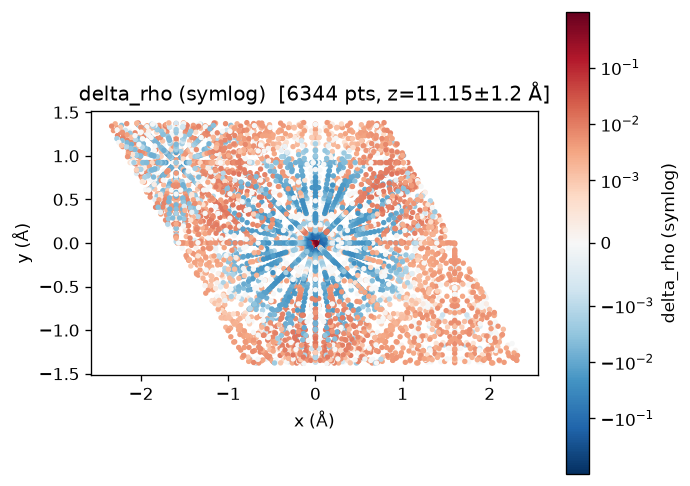

# Basic Usage

AimsPy is primarily used through its Python API, with a small command-line interface for managing the bundled FHI-aims patch. This page walks through the common workflows.

> **Note**: Forward SCF calculations work with any system type. However,
> extracting or injecting matrices (Hamiltonian, overlap, H_init, which are
> used
> in warmstart, capture, and export workflows below) requires a
> **periodic system** with `use_local_index = .false.`. For isolated
> molecules, use a sufficiently large periodic cell with vacuum (see the
> `from_scratch/run.py` example).

## 1. Python API

### Baseline SCF

The most common entry point is the one-shot `Calculator.do()` (or `Calculator.init()` then `Calculator.calc()`) wrapped in a context manager:

```python
from mpi4py import MPI
from aimspy import Calculator, CalculatorConfig

comm = MPI.COMM_WORLD
rank = comm.rank

config = CalculatorConfig(lib_path="/path/to/libaims.so")
with Calculator(config) as calc:
    calc.do(comm=comm, work_dir="./MoS2")
    if rank == 0:
        H = calc.hamiltonian     # AimspyMatrix (block-sparse, Hartree, rank-0 only)
        S = calc.overlap         # rank-0 fallback (see capture_overlap below)
    E = calc.energy          # float (Hartree)
    F = calc.forces          # (n_atoms, 3) ndarray in eV/Å, or None
```

Run with MPI:

```bash
mpiexec -np 8 python run_aims.py
```

`work_dir` must contain `control.in` + `geometry.in`, just like in a standard FHI-aims calculation.

Because of the multiple processes involved with MPI, the `Calculator` **not thread-safe**.

### Export to DeepH format

Export converged Hamiltonian, overlap, and free-atom initial Hamiltonian to the DeepH on-disk format:

```python
from mpi4py import MPI
from aimspy import Calculator, CalculatorConfig
from aimspy import DeepHData

comm = MPI.COMM_WORLD
rank = comm.rank

config = CalculatorConfig(
    lib_path="/path/to/libaims.so",
    capture_initial_hamiltonian=True,  # capture free-atom H0
)
with Calculator(config) as calc:
    calc.do(comm=comm, work_dir="./MoS2")

    # Export H, S, H0 to DeepH on-disk format
    if rank == 0:
        dd = DeepHData.from_aimspy(
            calc.structure,
            hamiltonian=calc.hamiltonian,
            overlap=calc.overlap,
            initial_hamiltonian=calc.initial_hamiltonian,
        )
        dd.save("deeph_out/")
```

To additionally export force-field labels to `force.h5`, pass the available
energy, force, and stress observables:

```python
    if rank == 0:
        dd = DeepHData.from_aimspy(
            calc.structure,
            hamiltonian=calc.hamiltonian,
            overlap=calc.overlap,
            initial_hamiltonian=calc.initial_hamiltonian,
            force=calc.forces,    # (n_atoms, 3) eV/Å, aims order — auto-reordered to POSCAR
            energy=calc.energy_free_relative,  # Hartree — auto-converted to eV
            stress=calc.stress,   # (3, 3) eV/ų
        )
        dd.save("deeph_out/")    # writes force.h5 alongside H/S/H0
```

Energy and force are optional and omitted when unavailable. Stress is always
written when `force.h5` is created: if `calc.stress` is `None`, the `(6,)`
dataset contains zeros in `[xx, yy, zz, yz, xz, xy]` order. `calc.forces`
requires `compute_forces .true.` and nonzero analytical stress data requires
`compute_analytical_stress .true.` in `control.in`.

`calc.energy_free_relative` is the force-consistent electronic free energy
minus the sum of the radial free-atom reference energies that FHI-aims already
computes for the resolved species settings.  Use
`calc.free_atom_reference_energies` for the per-species values and
`calc.free_atom_reference_energy` for their composition-weighted sum.

> **Note**: For the DeepH on-disk data format specification (POSCAR, info.json,
> .h5 files), see [DeepH-dock Key Concepts](https://docs.deeph-pack.com/deeph-dock/en/latest/key_concepts.html).

### DeepH warmstart

The central use case for AimsPy. Inject a pre-trained DeepH Hamiltonian as the initial guess and converge SCF in several iterations:

```python
from mpi4py import MPI
from aimspy import Calculator, CalculatorConfig, Strategy
from aimspy import DeepHData

data = DeepHData.from_directory("deeph_out/")
config = CalculatorConfig(lib_path="/path/to/libaims.so")
calc = Calculator(config)
calc.modify_init_ham(source=data, strategy=Strategy.REPLACE)
calc.do(comm=MPI.COMM_WORLD, work_dir="./MoS2")
```

**Deferred source**
generate the source at runtime (after H_init/overlap are available, inside the `python_func` callback):

```python
config = CalculatorConfig(
    lib_path="/path/to/libaims.so",
    capture_initial_hamiltonian=True,
    capture_overlap=True,
)
calc = Calculator(config)

@calc.modify_init_ham(strategy=Strategy.REPLACE, option={"deeph_path": "deeph_out/"})
def gen_source(calculator, option):
    # calculator.initial_hamiltonian / .overlap available here
    return DeepHData.from_directory(option["deeph_path"])

calc.do(comm=MPI.COMM_WORLD, work_dir="./MoS2")
```

### Modification strategies

The `Strategy` enum covers the common H0-modification cases:

| Strategy | Behaviour | Required argument |
|----------|-----------|-------------------|
| `REPLACE` | Clear and copy the external Hamiltonian's blocks into the live H0 (H_init) buffer | `source=` |
| `ADD`     | Add external blocks on top of the live H0 (e.g. a predicted H − H₀ to recover H) | `source=` |
| `SCALE`   | Multiply the live H0 by a constant factor | `factor=` (float) |
| `CUSTOM`  | Call `custom_fn(live, external, structure, aux)` to mutate the live matrix in place | `custom_fn=` (callable) |

For technical details on each strategy and the `modify_init_ham` API (direct vs. deferred mode, state guards), see [Key Concepts](./key_concepts.md#hamiltonian-modification-strategies).

### Capturing overlap and the free-atom H0

Two `CalculatorConfig` flags opt in to additional callbacks:

```python
config = CalculatorConfig(
    lib_path="/path/to/libaims.so",
    capture_initial_hamiltonian=True,   # export_h0 callback
    capture_overlap=True,               # export_ovlp callback (live, all ranks)
)
with Calculator(config) as calc:
    calc.do(comm=MPI.COMM_WORLD, work_dir="./MoS2")
    H0 = calc.initial_hamiltonian        # free-atom H_init (AimspyMatrix)
    S  = calc.overlap                    # live overlap on all ranks
```

Without `capture_overlap`, `calc.overlap` falls back to a rank-0 snapshot taken after `calc()`.

### Real-space grid data capture

Capture the converged electron density, Kohn-Sham potential, and grid geometry for post-processing:

```python
from mpi4py import MPI
from aimspy import Calculator, CalculatorConfig

comm = MPI.COMM_WORLD
rank = comm.rank

config = CalculatorConfig(
    lib_path="/path/to/libaims.so",
    capture_grid_data=True,  # export_grid_data callback
)
with Calculator(config) as calc:
    calc.do(comm=comm, work_dir="./MoS2")
    if rank == 0:
        gd = calc.grid_data              # GridData object
        gd.save_npz("grid.npz")          # save for offline analysis

        # Derived quantities
        print(f"delta_rho: {gd.delta_rho.min():.3e} .. {gd.delta_rho.max():.3e}")
        print(f"vxc range: {gd.vxc.min():.3f} .. {gd.vxc.max():.3f} Ha")
```

`GridData` fields include `coords`, `rho`, `vks`, `vks0`, `vh`, `vh0`, `rho0`, and structure fields (`atom_coords`, `atom_symbols`, `lattice`). See [Key Concepts](./key_concepts.md#grid-data-real-space) for the full field reference and units.

**MPI gather**: `GridData.gather(local, comm)` collects per-rank subsets to root using `Gatherv` (memory-efficient, zero-pickle). Root peak memory is ~1x the total dataset vs ~3x for pickle-based gather.

**Visualization**: the `aimspy.viz` module provides plotting helpers:

```python
from aimspy import viz

viz.scatter_slice(gd, value="delta_rho", ax=ax)  # 2-D scatter slice
viz.radial_profile(gd, value="rho", atom_index=0)  # radial profile
```

`viz` requires `matplotlib` (imported lazily). 3-D isosurfaces require `pyvista` (optional).



*Example: `viz.scatter_slice(gd, value="delta_rho")` on MoS₂ (LDA). The
symlog colour scale reveals weak charge-transfer features (0.001–0.01
e/bohr³) that a linear scale would flatten.*

### NAO radial basis capture

Capture the complete cubic-spline representation of the NAO radial basis
functions (u(r), (e−v)·u(r), du/dr, plus per-species log-grid parameters).
The callback fires once inside `prepare_scf` — before any SCF iteration —
so the data is available right after `calc.init()` (no `calc()` needed):

```python
config = CalculatorConfig(
    lib_path="/path/to/libaims.so",
    capture_basis_data=True,  # export_basis_data callback (registered pre-init)
)
with Calculator(config) as calc:
    calc.do(comm=comm, work_dir="./MoS2")
    if rank == 0:
        bd = calc.basis_data            # BasisData object

        # Evaluate radial functions at arbitrary distances (bohr)
        u = bd.evaluate_u(0, [0.5, 1.0, 2.0])   # species map attached automatically

        # Incremental H5 library (existing elements are skipped, not
        # overwritten), then plot offline:
        bd.save_h5("basis.h5", calc.info)
```

```bash
aimspy viz-basis basis.h5 -o figures/   # one radial-basis figure per element
```

See [Key Concepts](./key_concepts.md#nao-radial-basis-basisdata) for the
`basis.h5` layout, evaluation semantics, and units.

### Error recovery

If SCF crashes, use `force_close()` (always safe) and create a fresh `Calculator`.

FHI-aims is a **global singleton**: one `init`/`finalize` cycle per process, so a finalized `Calculator` cannot be reused.

> **Note**: `close()` / `force_close()` now calls `aimspy_export_grid_data_finalize()`
> to explicitly deallocate Fortran-side grid buffers (coords, potentials, vdW),
> preventing ~500 MB memory retention after the Calculator is closed.

**Context manager** (recommended: `__exit__` auto-calls `force_close()` on exception):

```python
config = CalculatorConfig(lib_path="...")
try:
    with Calculator(config) as calc:
        calc.do(comm=MPI.COMM_WORLD, work_dir="./MoS2")
        H = calc.hamiltonian
except Exception as e:
    print(f"SCF failed: {e}")
    # Calculator already force_closed by __exit__; create a new one to retry
```

**Manual pattern** (when you need finer control):

```python
calc = Calculator(CalculatorConfig(lib_path="..."))
try:
    calc.do(comm=MPI.COMM_WORLD, work_dir="./bad_input")
except Exception:
    calc.force_close()
    # create a new Calculator for the next run
```

`close()` is the graceful counterpart, silent no-op from `UNINIT`/`FINALIZED`, raises `AimspyStateError` from `RUNNING` (use `force_close`), and a normal finalize from `INITED`/`DONE`.

## 2. Command-line Tool

The `aimspy` CLI provides `patch` (manage the bundled FHI-aims patch: apply, uninstall, dry-run, list) and the visualization front-ends `viz-basis` / `viz-grid` (offline plotting from `basis.h5` / grid npz files). See the [CLI reference](./cli.md) for full options and examples.

## 3. Learning Through Examples

The [`examples/`](https://github.com/kYangLi/aimspy/tree/main/examples) directory in the repository contains two runnable end-to-end scripts:

- **`from_scratch/run.py`**
  H₂O baseline SCF + DeepH export. Demonstrates `CalculatorConfig.capture_initial_hamiltonian=True` + `capture_overlap=True`, and `DeepHData.from_aimspy(...).save(...)`.

- **`continue_calc/run.py`** 
  warmstart demo. Loads the previous run's DeepH output via `DeepHData.from_directory`, applies `Strategy.REPLACE` via `modify_init_ham(source=data)`, and shows SCF converging in several iterations.

Run them with:

```bash
export AIMSPY_TEST_AIMS_LIBPATH=/path/to/libaims.so
make run-from-scratch
make run-continue-calc    # requires run-from-scratch first
```

A MoS₂ integration test fixture (including a reference `rs_hamiltonian.out`) is available under `tests/data/MoS2/` for cross-validation.

## 4. Extending AimsPy

AimsPy is designed with extensibility in mind. If you want to add new functionality:

1. **New external matrix source**
   implement the `ExternalMatrixSource` protocol in a new subpackage under `aimspy/interface/<your_format>/`.

2. **New callback**
   follow the extension contract documented in the [Development Guide](./for_developers/development_guide.md#adding-a-new-callback).

3. **New modification strategy**
   extend the `Strategy` enum and the `_apply_strategy` dispatcher.

For detailed guidance, refer to the [Development Guide](./for_developers/development_guide.md).

## Need Help?

- Use `aimspy patch --help` for CLI assistance.
- Check the [`examples/`](https://github.com/kYangLi/aimspy/tree/main/examples) directory for practical implementations.
- For technical background on the in-memory architecture, callbacks, and data formats, see [Key Concepts](./key_concepts.md).
- For development questions, see the [For Developers](./for_developers/index.rst) section.
